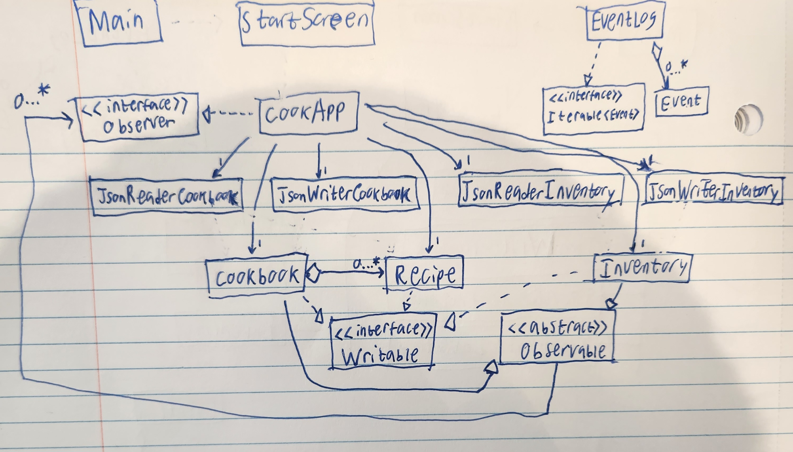

# My Personal Project - UBCCook

## Introduction

So...
**What is UBCCook?**

- This app is intended to help users with deciding what to cook depending on what is in your
  fridge and pantry or your "inventory" and depending on the recipes you inputted into
  the app can help you describe your options as to what you can cook

**Who will use it?**

- This app will be used by me, a student who has the responsibility of cooking my meals and meal prepping,
  as well as other students and users like me who have the responsibilities of cooking.

**Why is this project of interest to me?**

- As someone who is constantly trying to figure out what I need to cook for dinner or lunch, having an app
  like this would be very helpful and I personally believe many other users would find it as useful as me.

## User Stories
**User Story List:**
- As a user, I want to be able to add a recipe, including a title for the recipe and a list of ingredients
  for each recipe into "Recipes". 
- As a user, I want to be able to add ingredients into my "inventory"
- As a user, I want to be able to delete ingredients from my inventory
- As a user, I want to be able to view my cookbook (list of recipes) and view my inventory
- As a user, I want to be able to run a function that looks at my inventory and recipes and gives me the recipes I
  can make. (Compare)
- As a user, I want to be able to remove a recipe from the cookbook
- I want to be able to save my cookbook (list of recipes) (if I so choose)
- As a user, I want to be able to save my inventory (if I so choose)
- As a user, when I start the application, I want to be given the option to load my cookbook and inventory from file

## Instructions for Grader
- You can add recipes into the cookbook by pressing the "Add Recipe" button, adding the name and one ingredient
  on each line in the text area, and then pressing OK to add the recipe into the cookbook which is displayed
  automatically

- You can generate a list of recipes that can be made with the ingredients in your inventory by pressing "Generate Meal
  Options" button

- You can delete a recipe based on the name by pressing the "Delete Recipe" button, entering the name of the recipe
  and pressing Ok

- You can add Ingredients into the inventory by pressing "Add to Inventory", 
- You can locate my visual component when first running the app as the logo appears on the start screen
- You can save the state of my application by clicking on the "Save cookbook" or "Save Inventory" button
- You can reload the state of my application by clicking on the "Load/View cookbook" or "Load Inventory" button

## Phase 4: Task 3

If I had more time to work on the project, I might have refactored the JsonReader and JsonWriter for both 
Cookbook and Inventory. This not only would have shortened the documentation and made it less prone to errors, 
but it would have simplified the UML Design Diagram. This refactoring would have been done like through analyzing the 
similarities and differences in Cookbook and Inventory in order to find a way to make JsonReader and JsonWriter more 
streamline for both of them instead of creating one for each of them. Another refactoring I would have done would have
been related to the displaying of the Recipes and Inventory. I think it would have made more sense to have a completely
separate class that focused on just the displaying of both instead of placing all into the CookApp in order to follow
SRP better. 

